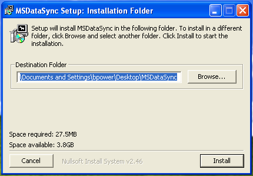
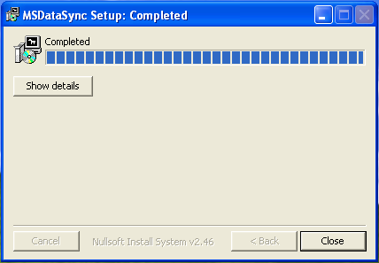
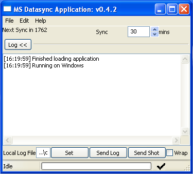
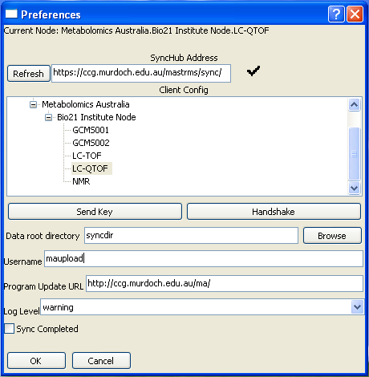

.. _datasync_client:

Data Sync
=========

The datasync process is the method by which data from the mass spec machines which have run the samples is transferred back to the Mastr-MS server and associated with the correct experiment and run. The process involves both the server (Mastr-MS website) and a number of 'clients' - programs which sit on the computers attached to the mass spec machines and periodically upload experiment data to the website. 

Data Sync Server
----------------

The server component of the datasync process is integrated into the website. Data sync clients will be configured to ask the server for information on data it expects them to have, and to receive other configuration variables relating to the data transfer. Configurations for the clients need to be created in the site admin. This is done in the site admin, under Mdatasync_Server->Node Clients.

Server Config
^^^^^^^^^^^^^

Clients are organised in three tiers: Organisation Name, Site Name, and Station Name. These values define the structure of how the datasync clients are deployed. The other fields needed for a node client definition are:

**Default data path**
    Not currently used. May be needed in future to modify destination data path per client.
**Username**
    The username to use for rsync transfer if none is supplied by the client.
**Hostname**
    The hostname of the rsync server for the client to transfer files to.
**Flags**
    Any other rsync flags to be passed down. These should be entered exactly as you would enter them on the command line, i.e: space separated command line flags, not quoted::
    
    -rvz
    --protocol=29 -rzv --chmod=ug=rwX

Note: The Node Rules feature (Node Rules in the admin) is unmaintained. It was designed so that special rules could be created for datasync client instances so that certain directories could be ignored or to force deletion of server side data, but was no great need was ever found for this feature: It worked when originally tested, but has not been maintained since that time.

Data Sync Client
----------------

The datasync client is a small executable designed to be run on a PC connected to a mass spec machine, and will upload data to the Mastr-MS website. It is written as a cross-platform application and can be run on Windows and Linux. Different installers are needed for each platform. The Windows installation is provided by default, and instructions for the Windows version are given here.

Client Installation
^^^^^^^^^^^^^^^^^^^

The default installation path is to the desktop, which is a convenient place to install to (since no icons or start menu entries are generated), but you can simply browse to create an alternate installation location if you wish.

Once you have selected an installation location and you choose 'Install', the installation continues.
During installation, the following tasks are carried out:

* The program code is installed to the installation directory
* The cwRsync component is installed for rsync connectivity
* The Microsoft Visual C++ redistributable is installed
* An RSA key pair is generated for the currently logged in user

Installation is complete when you see the following:

Client Config
^^^^^^^^^^^^^

Once the data sync client is installed, there are a number of items to be configured before the program can be used to sync data. Open the installation folder and double click 'main.exe'

From here, we need to click on **Edit->Preferences**

On this screen we need to do several things.

#. The SyncHub address will be set to the CCG Mastr-MS installation by default. If you need to change this, type a different URL ending in /sync/ into the Synchub address bar and press **Refresh**. A tick icon indicates the synchub replied with valid data. A cross may indicate that the URL is wrong, or the sever is incorrectly configured. 
#. You should see a tree containing all the Organisation, Nodes, and Machines that the SyncHub knows about. Firstly we need to expand the Node Tree and select the entry which represents the machine we will be syncing from. If your machine is not in the list, it will need to be set up on the server first.
#. Use the Browse button to select the root directory containing your data.
#. Change the username to maupload, or whichever user you have configured for rsync access. (This user should be a member of the group configured by the :ref:`CHMOD_GROUP variable <site_configuration_optional_variables>` )
#. Send your public key to the synchub by clicking the **Send Key** button. It should grey out momentarily and then return to normal.
#. Hit the **OK** button to save your changes.

You should now be back at the main screen, and you should have a log entry::
Key send response: ok

An email will have been generated to alert the administrators that a key has been sent, and that they should install it on the maupload rsync account. Syncing will not be able to occur until this has taken place.

The only other important configuration on the main screen is the *'Sync Frequency'*, which is by default 30 minutes. You can force the sync client to check right now by clicking **File->Check Now**.

If you close the client by clicking the **[X]** in the top corner of the window, or minimise it with **File->Minimize**, it will still be running in the background. You can tell if the client is running if you see this symbol in the system tray:

To re-open the client window, double click the icon, or right click and select **Open Main Window**.

To fully quit the program you must choose **File->Quit**.

The First Sync
^^^^^^^^^^^^^^

The first time the client detects files to sync and initiates the file transfer, a black command console box may appear and ask you to type 'yes' or 'no' to confirm that you want to connect to the server. Type *yes* to proceed. This is a one time operation.

Program Updates
^^^^^^^^^^^^^^^

Clicking **File->Program Updates** will check the server to see if any new updates are available. If a new version is available it will be downloaded and applied, and the application must be restarted for the updates to take effect.

